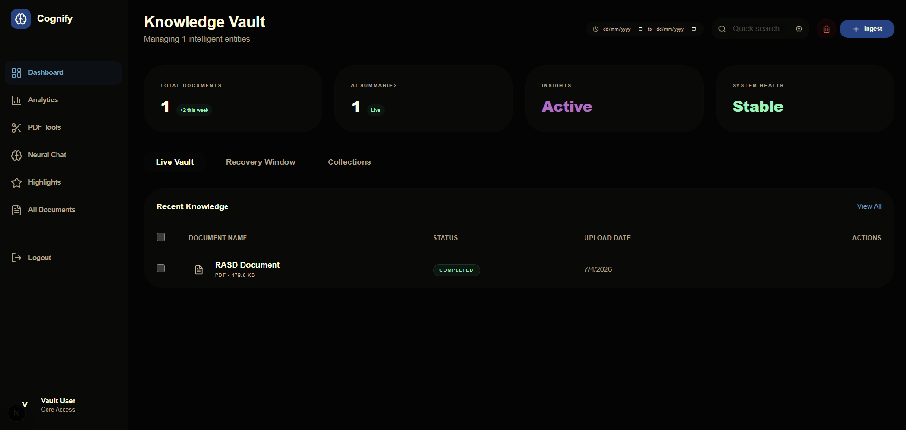
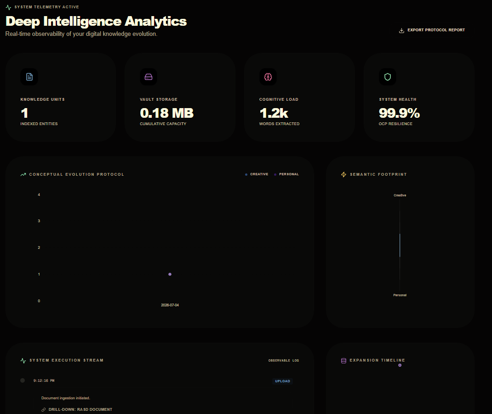
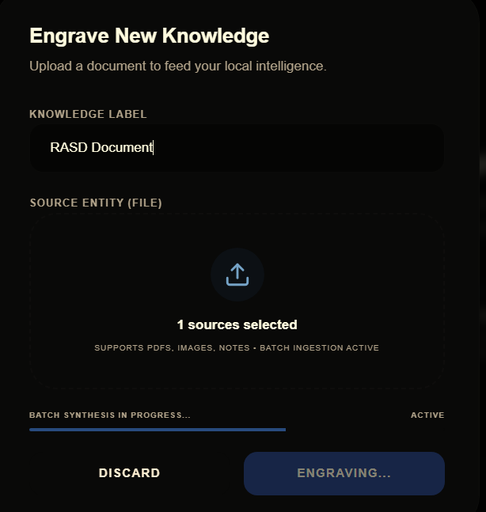

<div align="center">



# 🧠 Cognify PKM

**The Intelligent Knowledge Vault — AI-powered document management that understands your content.**

[](https://python.org)
[](https://djangoproject.com)
[](https://nextjs.org)
[](https://huggingface.co)
[](LICENSE)

</div>

---

## What is Cognify?

Cognify is a full-stack AI-powered Personal Knowledge Management system. Drop in scanned PDFs, images, or plain-text notes and Cognify immediately OCRs the content, summarizes it with a language model, classifies it by topic, and stores a semantic embedding — making every document instantly searchable, queryable, and analyzable.

> Think of it as a second brain that actually reads your documents.

---

## 📸 Application Screenshots

### 🗂️ Knowledge Vault Dashboard
> Track all your documents at a glance. Live status indicators, AI summary counts, system health, and quick-search.


---

### 📊 Knowledge Analytics
> Visualize topic evolution, upload trends, and storage growth with interactive Recharts dashboards. Sensitive documents are automatically excluded from all analytics.



---

### 💬 Neural Chat (Global RAG)
> Ask questions across your entire vault in natural language. The RAG engine retrieves the most semantically relevant document chunks and generates cited answers using RoBERTa.


---

### ✂️ PDF Tools
> Split, merge, reorder, or remove pages from any PDF — completely browser-native, no third-party service.


---

### 📥 Document Upload & Processing
> Upload files and watch the real-time processing pipeline: OCR → Summarization → Classification → Embedding → COMPLETED.



---

## 🏗️ System Architecture

```
┌─────────────────────────────────────────────────────────────┐
│                    Next.js 16 (Frontend)                    │
│  Dashboard · Analytics · Neural Chat · PDF Tools · Auth     │
└───────────────────────┬─────────────────────────────────────┘
                        │ REST API (JWT)
┌───────────────────────▼─────────────────────────────────────┐
│              Django REST Framework (Backend)                 │
│  Documents · Collections · Notes · Users · Analytics        │
└──────────┬──────────────────────────────┬───────────────────┘
           │ Task Queue                   │ Query
┌──────────▼──────────┐      ┌────────────▼──────────────────┐
│   Redis + Celery    │      │        SQLite Database         │
│   (Async Workers)   │      │  Metadata · Vectors · Logs    │
└──────────┬──────────┘      └───────────────────────────────┘
           │ Executes
┌──────────▼─────────────────────────────────────────────────┐
│                    AI Pipeline Engine                       │
│                                                            │
│  ┌─────────────┐  ┌──────────────┐  ┌───────────────────┐ │
│  │ OCR Module  │  │  LLM Module  │  │  Embedding Module │ │
│  │  OpenCV +   │  │  DistilBART  │  │  SentenceTransf.  │ │
│  │  Tesseract  │  │  + RoBERTa   │  │  all-MiniLM-L6-v2 │ │
│  └─────────────┘  └──────────────┘  └───────────────────┘ │
└────────────────────────────────────────────────────────────┘
```

---

## ✨ Core Feature Set

| Feature | Description |
|---|---|
| **🔍 Semantic Search** | Cosine similarity search using Sentence-BERT embeddings — finds meaning, not just keywords |
| **🤖 Auto-Summarization** | DistilBART condenses every document into a clear, concise summary on upload |
| **🏷️ Topic Classification** | Zero-shot MNLI classifier auto-tags documents across predefined knowledge categories |
| **💬 Global RAG Chat** | Ask questions across your entire vault; RoBERTa generates cited answers from top semantic matches |
| **📊 Knowledge Analytics** | Pandas-powered aggregation + Recharts visualizations: topic trends, storage curves, format distributions |
| **✂️ PDF Manipulation** | Native split, merge, reorder, and page deletion with PyPDF |
| **📝 Annotations & Notes** | Attach personal notes, highlights, and bookmarks to any document or extracted quote |
| **🔒 Sensitive Mode** | Per-document privacy flag — excludes files from analytics, RAG, and discovery |
| **📦 Version Control** | Full document versioning with parent-child lineage tracking |
| **🗑️ Soft Delete & Recovery** | Trash system with configurable recovery window before permanent deletion |
| **📈 Observability** | Prometheus metrics integration for task queue latency and worker resource usage |

---

## 🚀 Quick Start

### With Docker (Recommended)

```bash
# Clone the repository
git clone https://github.com/yourusername/cognify.git
cd cognify

# Build and launch the full stack
docker-compose up --build
```

| Service | URL |
|---|---|
| **Web Dashboard** | http://localhost:3000 |
| **REST API** | http://localhost:8000 |
| **API Explorer** | http://localhost:8000/api/schema/ |
| **Prometheus** | http://localhost:9090 |

---

### Manual Setup

#### Backend (Django + Celery)

```bash
# 1. Create and activate virtual environment
python -m venv venv
# Windows:
.\venv\Scripts\activate
# macOS/Linux:
source venv/bin/activate

# 2. Install dependencies
pip install -r backend/requirements.txt

# 3. Apply database migrations
cd backend
python manage.py migrate

# 4. Create a superuser account (optional)
python manage.py createsuperuser

# 5. Start the Celery background worker (in a separate terminal)
celery -A config worker -l info

# 6. Start the API server
python manage.py runserver
```

#### Frontend (Next.js)

```bash
cd frontend
npm install
npm run dev
```

> The frontend will be available at **http://localhost:3000**

---

## 🤖 AI Models Used

| Task | Model | Library |
|---|---|---|
| Text Extraction | Tesseract 5.0 + OpenCV | `pytesseract`, `cv2` |
| Summarization | `sshleifer/distilbart-cnn-12-6` | `transformers` |
| Classification | `valhalla/distilbart-mnli-12-1` | `transformers` |
| Semantic Embeddings | `all-MiniLM-L6-v2` | `sentence-transformers` |
| Extractive Q&A | `deepset/roberta-base-squad2` | `transformers` |

---

## 📁 Project Structure

```
cognify/
├── ai_pipeline/                  # Stateless AI modules (OCR · LLM · Embeddings)
│   ├── ocr/processor.py          # OpenCV preprocessing + Tesseract extraction
│   └── llm/
│       ├── summarizer.py         # DistilBART summarization
│       ├── classifier.py         # Zero-shot MNLI classification
│       ├── qa.py                 # RoBERTa extractive Q&A
│       └── embedder.py           # SentenceTransformers embeddings
├── backend/
│   ├── config/                   # Django settings, URL routing, Celery config
│   └── apps/
│       ├── documents/            # Core models, views, serializers, tasks, tests
│       └── users/                # JWT authentication endpoints
├── frontend/
│   └── src/app/
│       ├── page.tsx              # Landing page
│       ├── auth/                 # Login + Signup
│       └── dashboard/            # Main app (docs, analytics, chat, pdf-tools)
├── docs/
│   ├── Images/                   # Application screenshots
│   └── user_capabilities.md      # 100 documented user capabilities
├── docker-compose.yml            # Full-stack orchestration
└── README.md
```

---

## 🧪 Running Tests

```bash
# Run the full test suite (35 tests)
cd cognify
.\venv\Scripts\python.exe backend\manage.py test \
  apps.documents.tests.test_scenarios \
  apps.documents.tests.test_requirements \
  apps.documents.tests.test_use_cases_fulfillment \
  --noinput
```

**Expected output:** `Ran 35 tests — OK (0 failures)`

---

## 🔒 Security & Privacy

- **JWT Authentication** — All API routes require a valid JWT bearer token
- **User Data Isolation** — Every database query is scoped to the authenticated user; cross-user access returns `404`
- **Sensitive Mode** — Per-document flag that excludes files from global analytics, RAG, and search
- **Soft Delete** — Trashed documents have a recovery window before permanent deletion
- **Audit Logs** — Every meaningful action (UPLOAD, QUERY, TRASH, RESTORE, VERSION_NEW) is logged with user and timestamp

---

## 📄 License

This project is licensed under the **MIT License** — see [LICENSE](LICENSE) for details.

---

<div align="center">
  <sub>Built with ❤️ by Adem Bilge — turning documents into intelligence.</sub>
</div>
